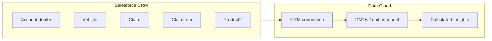

# Data Cloud — full setup guide (warranty agents & insights)

This guide is aligned with the **Warranty-Dev** project: Agentforce actions (`WC_VehicleLookupAction`, `WC_SuggestPartAction`, `WC_CreateClaimIntakeAction`), sample data seeders, and custom fields on **Claim**, **ClaimItem**, **Product2**, and the **WC_WarrantyClaimSubmitted__e** platform event.

Use it when you configure **Salesforce CRM → Data Cloud** so **Calculated Insights** match what the agents read and write in CRM.

---

## 1. Prerequisites

| Requirement | Notes |
|-------------|--------|
| **Data Cloud** (Data 360) enabled for your contract | Provisioned org or sandbox with Data Cloud. |
| **CRM org** | The Salesforce org where Claims, Vehicles, and dealers (`Account`) live — same org you deploy this package to. |
| **Permission to create connections** | Data Cloud admin / integration user can create a **Salesforce CRM** connection. |
| **Field-level security** | Integration profile can read all fields listed below (or use a dedicated **Data Cloud integration user** with read access). |

**Important:** DMO (Data Model Object) API names in Data Cloud are often **prefixed** (for example `ssot__Salesforce_Claim__dlm`). In the UI, use **display labels**; in SQL / API, copy the **exact API name** from Data Cloud after ingestion.

---

## 2. End-to-end flow



- **Agents** create/update **Claim** / **ClaimItem** and read **Vehicle** / **Product2** / **Account**.
- **Data Cloud** ingests the same objects (scheduled or near–real time).
- **Calculated Insights** aggregate by **dealer** (`Account` linked from `Claim.AccountId`) using **`WC_Claim_Effective_Date__c`** for time windows (not only `CreatedDate`).

---

## 3. Objects to include in the CRM data stream

Include these **at minimum** for the insights described in this project. Add optional objects if you need vehicle- or product-level dashboards.

| Priority | Object | Why |
|----------|--------|-----|
| **Required** | **Account** | Dealer dimension (`Claim.AccountId` → Account). |
| **Required** | **Claim** | Core fact table: amounts, dates, approval outcome, AI fields. |
| **Required** | **ClaimItem** | Line-level part (`ProductId`), labour, mileage proxy, repeat-part analysis. |
| **Strongly recommended** | **Product2** | Part catalogue: `ProductCode`, `WC_Fault_Keywords__c`, `WC_Model_Compatibility__c` (used by part suggestion). |
| **Recommended** | **Vehicle** | VIN, model, dealer link (`CurrentOwnerId`) for VIN-based journeys. |
| **Optional** | **Asset**, **AssetWarranty** | Extra warranty context (lookup uses these). |
| **Optional** | **WC_WarrantyClaimSubmitted__e** (platform event) | Real-time / streaming use cases; not required for batch Claim history insights. |

**Do not omit** custom fields in section 4 — filters and measures depend on **`WC_Claim_Effective_Date__c`**, **`WC_Approval_Result__c`**, and **`EstimatedAmount`**.

---

## 4. Field inventory (everything this project uses or deploys)

### 4.1 Account (standard)

| Field API name | Used for |
|----------------|----------|
| `Id` | Primary key; join target for `Claim.AccountId` and `Vehicle.CurrentOwnerId`. |
| `Name` | Dealer name (shown in lookup results, events, UIs). |

*No custom Account fields are in `WC_package.xml`; add your own org-specific fields to the stream if reports need them.*

---

### 4.2 Claim — standard fields referenced in code

| Field API name | Used for |
|----------------|----------|
| `Id` | Primary key. |
| `AccountId` | **Dealer** (foreign key to Account). **Dimension for all dealer insights.** |
| `Name` | Claim identifier (intake builds names with prefix `WTY-…`). |
| `OwnerId` | Claim owner (integration or agent user context). |
| `Summary` | Fault / symptom text from intake. |
| `Status` | Standard status (intake sets `Submitted` where valid). |
| `EstimatedAmount` | **Average amount per dealer**, totals, financial rollups. |
| `IsInhabitable`, `IsDrivable`, `IsAuthoritiesNotified` | Set by intake (defaults). |
| `CreatedDate` | System audit; **prefer `WC_Claim_Effective_Date__c` for analytics windows.** |

---

### 4.3 Claim — custom fields (package: `WC_*` on Claim)

These are deployed with the project and should be **included in the Data Cloud Claim DMO**.

| Field API name | Type / values | Purpose |
|----------------|----------------|---------|
| `WC_Claim_Source__c` | Picklist: Agentforce, Manual, Email | How the claim was created (intake = **Agentforce**; seed = **Manual**). |
| `WC_Submission_Channel__c` | Picklist (e.g. WhatsApp, Web, Portal) | Channel from intake. |
| `WC_Claim_Effective_Date__c` | Date | **Primary date for 30 / 60 / 90 day windows and last-claim date.** |
| `WC_Approval_Result__c` | Picklist: Pending, Approved, Rejected | **Approval / rejection rates** (intake sets **Pending**). |
| `WC_AI_Risk_Score__c` | Number | Optional AI risk score from intake. |
| `WC_AI_Summary__c` | Text (long) | Optional AI summary. |
| `WC_AI_Recommendation__c` | Text (long) | Optional AI recommendation. |
| `WC_Approval_Channel__c` | Text/Picklist | Optional approval channel. |
| `WC_Approved_By_User__c` | Lookup (User) | Optional approver. |
| `WC_Dealer_Notified_At__c` | DateTime | Optional notification timestamp. |
| `WC_Part_Coverage_Status__c` | Text/Picklist | Optional coverage status. |
| `WC_Rejection_Reason__c` | Text | Optional rejection reason. |
| `WC_Service_Bulletin_Ref__c` | Text | Optional bulletin reference. |

---

### 4.4 ClaimItem — standard + custom

| Field API name | Used for |
|----------------|----------|
| `Id` | Primary key. |
| `ClaimId` | Parent Claim. |
| `Name` | Line label. |
| `VehicleId` | Links line to **Vehicle**. |
| `ProductId` | **Spare part** Product2 — **repeat-part / same-dealer analysis.** |
| `Description` | Fault text on the line. |
| `FaultDate` | Line-level time. |
| `AssetUsageValue` | Mileage at claim (from intake odometer). |
| `WC_Labour_Hours__c` | Custom — labour hours. |

---

### 4.5 Vehicle — standard fields queried by agents

| Field API name | Used for |
|----------------|----------|
| `Id` | Passed to ClaimItem and intake. |
| `VehicleIdentificationNumber` | VIN match (17 characters). |
| `CurrentOwnerId` | **Dealer Account** (must match intake `dealerAccountId`). |
| `ModelName`, `ModelYear` | Part suggestion + lookup outputs. |
| `AssetId` | Warranty chain. |
| `ManufacturerWarrantyEndDate`, `ActiveWarrantyCount` | Warranty validation in intake. |

---

### 4.6 Product2 — standard + custom

| Field API name | Used for |
|----------------|----------|
| `Id`, `Name`, `ProductCode`, `IsActive` | Catalogue resolution for part suggestion. |
| `WC_Fault_Keywords__c` | Long text — keyword / fallback matching. |
| `WC_Model_Compatibility__c` | Text — model compatibility for suggestion filtering. |

---

### 4.7 Asset & AssetWarranty (optional for insights)

Used by **Vehicle** lookup and intake warranty checks. Include if insights reference warranty end dates at asset level.

| Object | Fields used in code |
|--------|---------------------|
| **Asset** | `Id`, `AccountId`, `Product2Id` (as applicable). |
| **AssetWarranty** | `AssetId`, `EndDate`, `WarrantyTermId`. |

---

### 4.8 Platform event `WC_WarrantyClaimSubmitted__e` (optional stream)

Published when intake succeeds. Fields in package:

| Field API name | Purpose |
|----------------|---------|
| `WC_Claim_Id__c` | Claim Id. |
| `WC_Claim_Name__c` | Claim name. |
| `WC_Dealer_Account_Id__c` | Dealer Account Id. |
| `WC_Dealer_Name__c` | Dealer name. |
| `WC_VIN__c` | VIN. |
| `WC_Estimated_Value__c` | Amount. |
| `WC_Risk_Score__c` | AI risk. |
| `WC_Recommended_Action__c` | e.g. Review. |
| `WC_Submitted_At__c` | Event time. |

Use for **streaming** or **near–real-time** Data Cloud pipelines; **historical batch insights** can rely on **Claim** alone.

---

### 4.9 Custom metadata (not for Data Cloud DMO)

`WC_Prompt_Config__mdt` drives **Einstein prompt template** names in Apex — **no need** to ingest for Claim analytics unless you document AI ops.

---

## 5. Step-by-step: connect CRM and ingest (Data Cloud UI)

Steps use typical Data Cloud labels; minor differences may appear by release.

### Step 1 — Open Data Cloud

1. Log in to the **Data Cloud**–enabled org (or launch Data Cloud from App Launcher).
2. Confirm you are in the correct **Data Space** (e.g. default or project-specific space).

### Step 2 — Create or verify Salesforce CRM connection

1. Go to **Connections** (or **Integrations** → **Connections**).
2. **New** → **Salesforce CRM** (or **Salesforce**).
3. Authenticate to the **same CRM org** where warranty data lives (OAuth).
4. Save the connection and wait until status is **Connected** / **Active**.

### Step 3 — Create a data stream (ingestion)

1. **Data Streams** → **New** (or **Ingest Data**).
2. Choose **Salesforce CRM** and the connection from Step 2.
3. Select objects (section 3): at minimum **Account**, **Claim**, **ClaimItem**; add **Product2**, **Vehicle** as needed.
4. For each object, **select all fields** listed in **section 4** for that object.  
   - If the UI offers “recommended fields only,” switch to **full field list** and include **every custom field** above to avoid empty columns in insights.

### Step 4 — Schedule and run

1. Set **sync frequency** (hourly / daily) per org policy.
2. Run an **initial full sync** or wait for first run.
3. Open **Data Explorer** (or equivalent) and confirm row counts for **Claim** and **ClaimItem**.

### Step 5 — Data model / DMO mapping

1. Open **Data Model** / **DMO** configuration for your space.
2. Locate ingested entities (names may be prefixed). Confirm:
   - **Claim** has `AccountId`, `EstimatedAmount`, `WC_Claim_Effective_Date__c`, `WC_Approval_Result__c`, and other WC fields.
   - **ClaimItem** has `ClaimId`, `ProductId`, `VehicleId`.
3. Define or verify **relationships**:
   - Claim → Account on `Claim.AccountId` = `Account.Id`
   - ClaimItem → Claim on `ClaimItem.ClaimId` = `Claim.Id`
   - ClaimItem → Product2 on `ClaimItem.ProductId` = `Product2.Id`
   - ClaimItem → Vehicle on `ClaimItem.VehicleId` = `Vehicle.Id` (if Vehicle is ingested)

### Step 6 — Validate joins

Run a simple exploration query (SQL or UI) equivalent to:

- Count of claims by `AccountId` for the last 90 days using **`WC_Claim_Effective_Date__c`**.

If counts are zero, check field mapping and sync status.

---

## 6. Calculated insights — definitions (Data Cloud only)

Build **Calculated Insights** in Data Cloud (SQL or Insight Builder, depending on your release). Use **`WC_Claim_Effective_Date__c`** as the **business date** for filters. Replace `claim_dmo` / `account_dmo` with **your actual DMO API names**.

**Common filter (last 90 days):**

```sql
-- Illustrative — replace table/column names with your DMO fields
WHERE wc_claim_effective_date__c >= CURRENT_DATE - INTERVAL '90' DAY
```

---

### Insight A — Claim volume (30 / 60 / 90 days) per dealer

| | |
|--|--|
| **Grain** | One row per **dealer** (`Account`) per insight or one insight with three measures. |
| **Dimension** | Dealer: `Account.Id` (via `Claim.AccountId`). |
| **Measures** | `COUNT(*)` of claims where `WC_Claim_Effective_Date__c` ≥ today−30 / −60 / −90 days (three measures or three insights). |
| **Required fields** | `Claim.AccountId`, `Claim.WC_Claim_Effective_Date__c` |

---

### Insight B — Last claim date per dealer

| | |
|--|--|
| **Grain** | Per dealer |
| **Measure** | `MAX(WC_Claim_Effective_Date__c)` |
| **Required fields** | `Claim.AccountId`, `Claim.WC_Claim_Effective_Date__c` |

---

### Insight C — Average estimated amount per claim, per dealer

| | |
|--|--|
| **Grain** | Per dealer (average across **claims**, not claim lines, unless you specify otherwise). |
| **Measure** | `AVG(EstimatedAmount)` **or** `SUM(EstimatedAmount) / COUNT(*)` for claims with non-null amount in the window. |
| **Filter** | Same date window as other KPIs, e.g. last 90 days on `WC_Claim_Effective_Date__c`. |
| **Required fields** | `Claim.AccountId`, `Claim.EstimatedAmount`, `Claim.WC_Claim_Effective_Date__c` |

**Note:** Null amounts: decide whether to exclude nulls from AVG (standard SQL AVG behavior) or coalesce to zero in your business rules.

---

### Insight D — Approval / rejection rates per dealer

| | |
|--|--|
| **Grain** | Per dealer |
| **Measures** | Count where `WC_Approval_Result__c` = `Approved`, `Rejected`, `Pending` (in the same window). |
| **Derived rate** | e.g. **Approved ÷ (Approved + Rejected)** excluding Pending from denominator if you only want “decided” claims. |
| **Required fields** | `Claim.AccountId`, `Claim.WC_Approval_Result__c`, `Claim.WC_Claim_Effective_Date__c` |

---

### Insight E — Repeat issues (same part, same dealer)

| | |
|--|--|
| **Grain** | Dealer + **Product2** (part) |
| **Logic** | From **ClaimItem** joined to **Claim**: count **distinct Claim Ids** or **line count** per (`AccountId`, `ProductId`) in the window; flag pairs where count ≥ 2 (or ≥ 3). |
| **Required fields** | `Claim.AccountId`, `Claim.Id`, `Claim.WC_Claim_Effective_Date__c`, `ClaimItem.ProductId`, `ClaimItem.ClaimId` |
| **Optional** | `Product2.Name`, `Product2.ProductCode` for labels |

---

## 6.1 Step-by-step: create insights A–E in the org (Builder vs SQL)

UI labels may show **Data Cloud** or **Data 360** depending on org and release. The flow below matches current Salesforce documentation (e.g. [Agentforce Data Cloud workshop — Exercise 7](https://developer.salesforce.com/agentforce-workshop/data-cloud/7-create-calculated-insights)).

### Before you start (all insights)

1. Open **App Launcher** → **Data Cloud** (or **Data 360**).
2. Confirm **CRM data streams** have run successfully and **Claim** rows appear in **Data Explorer** (or SQL query tool).
3. Note your **Claim DMO** and **Account DMO** API names from **Data Model** / **Data Spaces** (often prefixed, e.g. `ssot__Salesforce_Claim__dlm`). You will pick these in the builder or paste into SQL.
4. Go to the **Calculated Insights** tab (sometimes under **Insights**).

### How you create a Calculated Insight (two entry points)

| Path | In the UI | Best for |
|------|-----------|----------|
| **Visual (Insight Builder)** | **New** → **Create with Builder** → **Next** → keep **Calculated Insight** → **Next** | Joining DMOs with guided **Join** / **Aggregate** / **Dimensions**; **Max**, **Count**, **Avg** with UI filters. |
| **SQL** | **New** → **Create with SQL** (wording may be **SQL Editor** or similar) | **Conditional counts** (30/60/90, Approved/Rejected), **HAVING** (repeat parts ≥ 2), **CASE** expressions, one query with many columns. |

**Practical recommendation for this project**

| Insight | Suggested approach | Why |
|---------|-------------------|-----|
| **A** (30/60/90 volumes) | **SQL** first (three conditional sums/counts in one query), or **Builder** with **three Count measures** each with its **own date filter** on `WC_Claim_Effective_Date__c` | Builder works if your release supports **per-measure filters**; SQL is one place to see all windows. |
| **B** (last claim date) | **Builder** | Single **Max** on a date with **Dimension** = dealer `AccountId`. |
| **C** (avg amount per dealer) | **Builder** | **Avg** on `EstimatedAmount` + **Filter** on last 90 days (insight-level or measure-level). |
| **D** (approval counts / rates) | **SQL** for four columns in one row, or **Builder** with **three Count** measures (each filtered by picklist value) | Rates in % often need a **formula** in a dashboard or a **second** SQL insight dividing columns. |
| **E** (repeat part + dealer) | **SQL** with `GROUP BY` + `HAVING COUNT(...) >= 2` | Rolling up to “only repeats” is awkward in pure Builder; SQL is direct. |

Below: **Builder** steps follow the same pattern as Salesforce’s workshop (Select Object → Join → Aggregate → Dimensions → Save and Run → Enable → Publish). **SQL** steps assume you paste SQL into the editor and map dimensions/measures per your org’s wizard.

---

### Shared Builder steps (reference)

Use this skeleton whenever you choose **Create with Builder**:

1. **New** → **Create with Builder** → **Next** → **Calculated Insight** → **Next**.
2. **Select an Object** → choose your **Claim** DMO → **Next**.
3. **Join** (optional but recommended for dealer name): **+** next to Claim → **Join** → select **Account** DMO → match `Claim.AccountId` = `Account.Id` → **Apply**.
4. **+** → **Aggregate** → **Measures** → **+** → pick function (**Count** / **Max** / **Avg** / **Sum**) and field.
5. **Dimensions** → **+** → choose field(s) to **GROUP BY** (e.g. `AccountId` from Claim, or `Account.Id` from joined Account).
6. Add **Filter** nodes or **insight-level filters** as your UI provides: restrict to **last 90 days** using `WC_Claim_Effective_Date__c` (relative date).
7. **Save and Run** → name the insight → **Enable** → **Publish Now** (or schedule). Refresh until status is **Success** / **Active**.

If any button is missing, use **zoom out** or full-screen — Salesforce notes this for **Select an Object**.

---

### Insight A — Claim volume (30 / 60 / 90 days) per dealer

**Goal:** One row per dealer with three counts: claims in last 30, 60, and 90 days (by `WC_Claim_Effective_Date__c`).

#### Option 1 — SQL (recommended)

1. **New** → **Create with SQL** → **Calculated Insight** (if prompted).
2. In the SQL editor, build a query that:

   - `FROM` your **Claim** DMO (replace placeholder).
   - `WHERE WC_Claim_Effective_Date__c` is not null (optional).
   - `GROUP BY` dealer key: `AccountId` (or joined `Account.Id`).
   - **Measures** as three expressions, for example (syntax must match [Data Cloud SQL](https://developer.salesforce.com/docs/data/data-cloud-query-guide/references/dc-sql-reference/aggregate.html) for your release):

   - Count last 30 days: conditional count where `WC_Claim_Effective_Date__c >= today - 30 days`.
   - Same for 60 and 90.

   Exact date functions may be `CURRENT_DATE`, `DATEADD`, etc. — use the **Functions** tab in the SQL UI to insert valid functions.

3. **Map** any required **Dimensions** (dealer id) per the wizard.
4. **Save** → **Run** → **Enable** → **Publish**.

Name example: `WC_Claim_Volume_30_60_90_By_Dealer`.

#### Option 2 — Visual Builder

1. **Create with Builder** → base object = **Claim** DMO.
2. **Join** → **Account** (optional, for labels).
3. **Aggregate** → add **Measure 1**: **Count** of `Claim Id` (or row count) → add **filter**: `WC_Claim_Effective_Date__c` **greater or equal** **relative** **Last 30 days** (or equivalent).
4. Add **Measure 2** and **Measure 3** with **60** and **90** day filters (same field).
5. **Dimensions** → **+** → `AccountId` (from Claim) — name e.g. `DealerAccountId`.
6. **Save and Run** → enable → publish.

If the Builder does not allow three different date filters on **Count**, use **three separate** Calculated Insights (A-30, A-60, A-90) each with one measure and one filter, or use **SQL** Option 1.

---

### Insight B — Last claim date per dealer

**Goal:** `MAX(WC_Claim_Effective_Date__c)` grouped by dealer.

#### Visual Builder (recommended)

1. **Create with Builder** → **Claim** DMO.
2. **Join** → **Account** (optional).
3. **Aggregate** → **Measures** → **+** → **Max** → select **`WC_Claim_Effective_Date__c`** → name e.g. `LastClaimEffectiveDate`.
4. **Dimensions** → **+** → `AccountId` from Claim.
5. **Save and Run** → **Enable** → **Publish**.

#### SQL (alternative)

- `SELECT AccountId, MAX(WC_Claim_Effective_Date__c) ... GROUP BY AccountId` from Claim DMO.

Name example: `WC_Last_Claim_Date_By_Dealer`.

---

### Insight C — Average estimated amount per claim, per dealer (e.g. last 90 days)

**Goal:** `AVG(EstimatedAmount)` per `AccountId`, claims with `WC_Claim_Effective_Date__c` in the last 90 days.

#### Visual Builder (recommended)

1. **Create with Builder** → **Claim** DMO.
2. **Aggregate** → **Avg** → **`EstimatedAmount`** → name `AvgEstimatedAmount`.
3. Add **insight filter** (or filter node): `WC_Claim_Effective_Date__c` in range **last 90 days** (relative).
4. **Dimensions** → `AccountId`.
5. **Save and Run** → **Enable** → **Publish**.

**Null handling:** If the UI offers “ignore nulls” for Avg, use it; otherwise document that `AVG` excludes null amounts by SQL rules.

#### SQL (alternative)

- `SELECT AccountId, AVG(EstimatedAmount) FROM ... WHERE WC_Claim_Effective_Date__c >= ... GROUP BY AccountId`

Name example: `WC_Avg_Claim_Amount_90d_By_Dealer`.

---

### Insight D — Approval / rejection (and pending) counts per dealer

**Goal:** Counts of `WC_Approval_Result__c` in {Approved, Rejected, Pending} in the same window (e.g. 90 days); **rate** = Approved ÷ (Approved + Rejected) if you exclude Pending from denominator.

#### SQL (recommended for one table with three or four measures)

1. **Create with SQL** → from **Claim** DMO.
2. `WHERE WC_Claim_Effective_Date__c` in last 90 days.
3. `GROUP BY AccountId`.
4. Measures using **conditional aggregation**, for example:

   - `SUM(CASE WHEN WC_Approval_Result__c = 'Approved' THEN 1 ELSE 0 END)` as `CntApproved`
   - Same for `Rejected`, `Pending`.

5. Optional fourth column: **approval rate** =  
   `CntApproved / NULLIF(CntApproved + CntRejected, 0)` (syntax per platform).

6. Save, run, enable, publish.

Name example: `WC_Approval_Outcomes_90d_By_Dealer`.

#### Visual Builder

1. **Claim** DMO → **Aggregate**.
2. Add **three** **Count** measures; each measure has a **filter** `WC_Approval_Result__c` equals **Approved**, **Rejected**, **Pending** respectively.
3. Add **insight filter**: last 90 days on `WC_Claim_Effective_Date__c`.
4. **Dimension**: `AccountId`.
5. **Save and Run** → publish.

**Rate in %:** Often done in **CRM Analytics**, **Tableau**, or **Slack** consuming the API — not always inside the CI row.

---

### Insight E — Repeat issues (same part, same dealer)

**Goal:** Pairs (dealer, product) with **at least two** claims (or two lines) in the window — “repeat” pattern.

You need **ClaimItem** joined to **Claim** so each line carries `ProductId` and Claim carries `AccountId` and date.

#### SQL (recommended)

1. **Create with SQL**.
2. `FROM` **ClaimItem** DMO  
   **INNER JOIN** **Claim** DMO on `ClaimItem.ClaimId = Claim.Id`
3. **LEFT JOIN** **Product2** on `ClaimItem.ProductId = Product2.Id` (optional, for labels in a separate insight or same query if allowed).
4. `WHERE Claim.WC_Claim_Effective_Date__c` in last 90 days.
5. `GROUP BY Claim.AccountId`, `ClaimItem.ProductId`
6. `HAVING COUNT(DISTINCT Claim.Id) >= 2` — or `COUNT(*) >= 2` depending on whether “repeat” means duplicate lines or duplicate claims.

7. **Select** dimensions + `COUNT` or `COUNT DISTINCT` as needed.

8. Save, run, enable, publish.

Name example: `WC_Repeat_Part_By_Dealer_90d`.

#### Visual Builder (limited)

1. Start from **ClaimItem** DMO → **Join** → **Claim** → **Join** → **Account** / **Product2**.
2. **Dimension**: `AccountId` (from Claim) **and** `ProductId` (from ClaimItem).
3. **Measure**: **Count** distinct `Claim Id` or Count of rows.
4. **Filter** post-aggregation: many orgs **cannot** express `HAVING >= 2` in Builder — if so, **use SQL** for Insight E, or build a **second** insight that reads from a staging table.

---

### After publishing (all types)

1. Open the **Calculated Insight** record → confirm **Run status** / **Last run** succeeded.
2. Use **Query API** or **Data Explorer** (per [query calculated insights](https://developer.salesforce.com/docs/data/data-cloud-query-guide/references/data-cloud-query-api-reference/c360a-api-ci-ci-name.html)) to validate a few dealers against CRM reports.
3. Optional: add to **DevOps Data Kit** for promotion (see §8).

---

## 7. Agent action ↔ data mapping (quick reference)

| Agent action | CRM objects / fields |
|--------------|---------------------|
| **WC_VehicleLookupAction** | `Vehicle` (VIN, `CurrentOwnerId`, warranty fields), `Account` (name), `AssetWarranty` |
| **WC_SuggestPartAction** | `Product2` (`ProductCode`, `WC_Fault_Keywords__c`, `WC_Model_Compatibility__c`), Einstein prompt / Knowledge (outside Data Cloud DMO unless you ingest Knowledge) |
| **WC_CreateClaimIntakeAction** | `Claim` (all fields in §4.2–4.3), `ClaimItem` (§4.4), `WC_WarrantyClaimSubmitted__e` |

Insights for **approvers in Slack** should be built on **Claim** + **Account** at minimum; add **ClaimItem** + **Product2** for repeat-part and catalogue context.

---

## 8. Exporting insights for DevOps (optional)

After insights are created in a **sandbox** Data Cloud org:

1. Create a **DevOps Data Kit** (or equivalent) in Data Cloud Setup.
2. Add your Calculated Insights to the kit.
3. **Download manifest** / **retrieve** metadata into your repo.
4. Deploy to other environments with the Salesforce CLI per [Data 360 deployment guide](https://developer.salesforce.com/docs/data/data-cloud-dev/guide/dc-deploy_data_kit_using_cli.html).

Exact metadata types vary by release; use the kit manifest as the source of truth.

---

## 9. Troubleshooting

| Symptom | Check |
|---------|--------|
| Empty Claim rows in Data Cloud | CRM connection status; object included in stream; field visibility for integration user. |
| Wrong counts vs CRM report | Use **`WC_Claim_Effective_Date__c`**, not `CreatedDate`, for business windows. |
| Missing custom fields on Claim | Re-save stream with full field selection; run full refresh. |
| Einstein agent user vs insights | Agent runtime user does not need Data Cloud access for **precomputed** insights in Slack if Slack reads **published** CI outputs or a summary object. |

---

## 10. Document history

| | |
|--|--|
| **Project** | Warranty-Dev — WC Agentforce claim intake |
| **Package manifest** | `manifest/WC_package.xml` lists deployable Claim / ClaimItem / Product2 / event fields |

For **seed data** commands and dealer names used in demos, see `data-cloud/README.md`.
